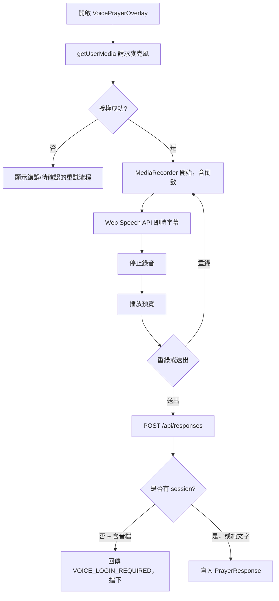
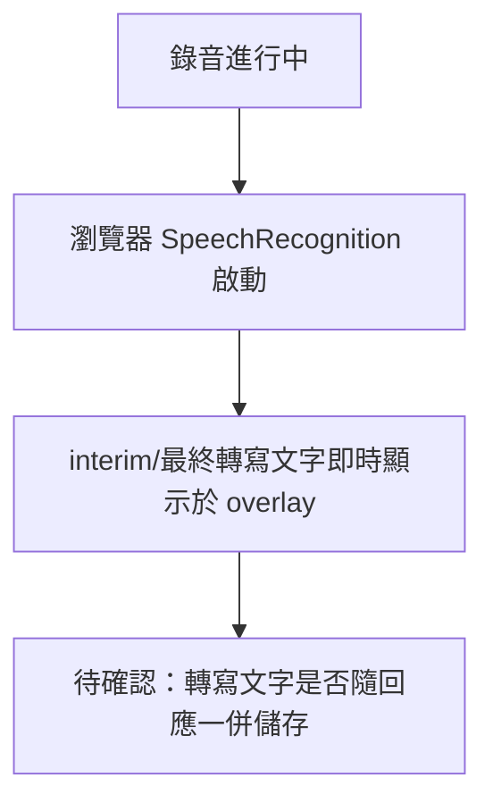

# 目前實際使用者流程

僅描述程式碼中**實際存在**的流程，依據 [[03-Current-Feature-Inventory]]、[[06-Authentication-Dependencies]]。標註「待確認」處代表尚未在程式碼中找到明確證據。

> **2026-08-04 更新**：以下「新使用者進站」與「錄音」兩個流程圖是 2026-08-03 的歷史快照，描述**改造前**的首頁（含地球 hero、`VoicePrayerOverlay` 僅存在於 `/prayfor/[id]` 回應流程）。首頁改造後（Commit 2、3、A、B）的實際新流程見 [[08-Target-User-Flows]]、[[21-Recorder-State-Machine]]、[[25-Companion-Mode-Reuse-Audit]]。此處保留原圖僅供對照「改造前 vs 改造後」，且原圖內「three.js 地球 Hero」的描述本身也已被 [[02-Current-Architecture]] 更正為 Cesium（並非 three.js）。
>
> **另一項已過時之處**：下方「錄音」流程圖中的 `VOICE_LOGIN_REQUIRED` 卡點已於 Phase 3A（2026-08-04）移除，語音回應現已支援匿名送出，詳見 [[20-Anonymous-Submission-Design]]、[[15-Acceptance-Criteria]]；此圖仍保留原樣作為「改動前」歷史對照，不代表目前行為。

## 新使用者進站（2026-08-03 歷史快照，首頁已改版，見上方說明）
```mermaid
flowchart TD
    A[進入 /] --> B[HomeLandingPage 載入]
    B --> C[Cesium 地球 Hero 動畫（現已移除，改用 HomePrayerHero）]
    B --> D[HomePrayerExplorer 顯示禱告牆]
    D --> E{點擊項目}
    E -->|卡片| F[/prayfor/[id] 詳情頁]
    E -->|導覽列| G[禱告牆/全球禱告室/得勝者/會員中心]
```

## 註冊
```mermaid
flowchart TD
    A[/signup] --> B[SignupForm 填寫 email/密碼]
    B --> C[POST /api/auth/signup]
    C --> D{建立成功?}
    D -->|是| E[User 建立 + 導向登入或自動登入]
    D -->|否| F[顯示錯誤]
```

## 登入
```mermaid
flowchart TD
    A[/login] --> B[LoginForm 輸入帳密]
    B --> C[POST /api/auth/login]
    C --> D{驗證成功?}
    D -->|是| E[建立 customer session cookie]
    E --> F[useAuthSession 更新前端狀態]
    D -->|否| G[顯示錯誤]
```

## 錄音（既有會員回應流程，`/prayfor/[id]` via `Comments.js`/`VoicePrayerOverlay.js`，現況：僅在特定入口且語音送出被登入卡關）
> 首頁另有一條**獨立**的新錄音流程（`src/components/prayer-recorder/`），與下圖無關，見 [[21-Recorder-State-Machine]]。首頁版本目前送出僅顯示 Prototype 提示，尚未接上任何 API。


## 投稿（建立禱告卡片）
```mermaid
flowchart TD
    A[/customer-portal/create] --> B[待確認：是否強制要求 customer session]
    B --> C[填寫標題/內容/分類]
    C --> D[POST /api/home-cards]
    D --> E[HomePrayerCard 建立，ownerId 可為 null]
```

## 播放
```mermaid
flowchart TD
    A[禱告牆或詳情頁] --> B[點擊播放]
    B --> C[GlobalPlayer / PrayerAudioPlayer]
    C --> D[GET /voices/[...path] 或 /uploads/[...path]]
    D --> E[音檔串流播放，無需登入，亦無存取驗證]
```

## 字幕


## 為他人禱告
```mermaid
flowchart TD
    A[瀏覽 /prayfor/[id]] --> B[閱讀/收聽既有回應列表]
    B --> C[透過 POST /api/responses 送出文字或語音回應]
    C --> D{含語音?}
    D -->|是| E[需要登入，見上方錄音流程]
    D -->|否| F[免登入即可送出，guestSessionHash/ipHash 記錄]
    F --> G[待確認：是否有獨立「我為你禱告」一鍵按鈕，或僅等於送出回應]
```
> **2026-08-05 更新（Commit C1）**：上圖「D -->|是| E[需要登入]」這條分支現在**只描述 `Comments.js` 既有的登入者語音composer**（未變更）。頁面上另外新增了一個獨立、不需要登入即可使用的匿名錄音入口（`DetailPrayerInteractionPanel`，重用首頁同一顆 `PrayerRecorder`），兩者並存，見 [[08-Target-User-Flows]] 流程 8c、[[27-Shared-Prayer-Interaction-Audit]]。「檢舉」也已開放給未登入訪客使用（陪伴模式三點選單），見流程 8b、[[26-Anonymous-Reporting-Design]]。
>
> **2026-08-05 更新（Commit 1）**：「我已為你禱告」已實作為獨立於上圖回應流程的輕量按鈕（`PrayedReactionButton`），未登入與已登入皆可使用，不建立 `PrayerResponse`，見 [[08-Target-User-Flows]] 流程 8d、[[28-Prayed-Reaction-Design]]。

## 管理內容
```mermaid
flowchart TD
    A[/admin 登入 + TOTP] --> B[middleware 驗證 start-pray-admin-session cookie]
    B --> C[/admin/dashboard]
    C --> D[prayfor / prayerresponse / moderation / users / content / home-categories / log / settings]
    D --> E[requireAdmin() 逐一驗證角色]
    E --> F[SUPER-only: users / log / settings]
```
