# 目標使用者流程（提案，部分已實作）

參見 [[07-Target-MVP]]、[[09-Change-Impact-Analysis]]、[[21-Recorder-State-Machine]]、[[25-Companion-Mode-Reuse-Audit]]、[[26-Anonymous-Reporting-Design]]、[[27-Shared-Prayer-Interaction-Audit]]、[[28-Prayed-Reaction-Design]]。以下原為**設計提案**；流程 1-5 已於 Commit 2、3（2026-08-04）在首頁實作為前端狀態機（`src/components/prayer-recorder/`）；流程 6（匿名送出）已於 Phase 3A（2026-08-04）接上真實 API；流程 6b、8（瀏覽並播放禱告）已於 Commit A/B（2026-08-04）實作；流程 8b（匿名檢舉）、8c（`/prayfor/[id]` 匿名錄音）已於 Commit C1（2026-08-05）實作；流程 9（我已為你禱告）已於 Commit 1（2026-08-05）實作；流程 10 仍是提案，未實作。

## 1. 陌生人第一次進站 — ✅ 已實作（Commit 2）
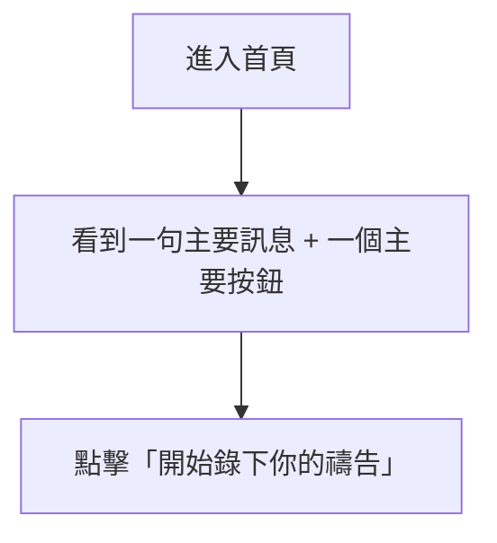

## 2. 麥克風授權成功 — ✅ 已實作（Commit 3，Real microphone Not Tested，見 [[21-Recorder-State-Machine]]）
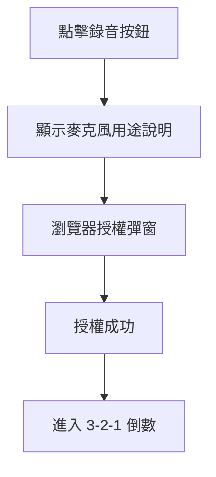

## 3. 麥克風授權失敗 — ✅ 已實作並經真實瀏覽器驗證（非 Mock，Browser 環境本身封鎖麥克風存取觸發了真實拒絕路徑）
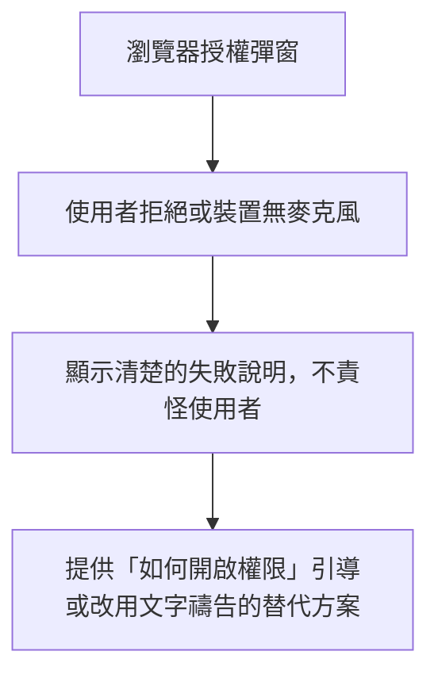

## 4. 錄音與倒數 — ✅ 已實作（Real microphone Not Tested）
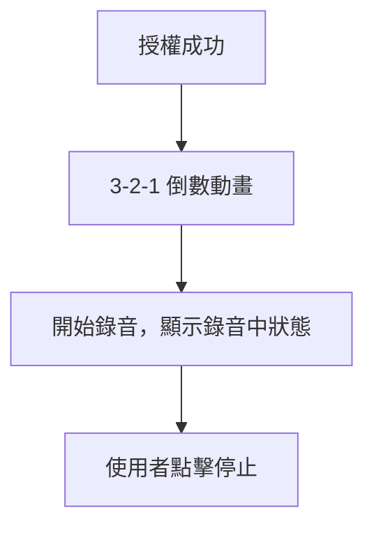

## 5. 播放確認與重錄 — ✅ 已實作，含重錄確認對話框（Real microphone Not Tested）
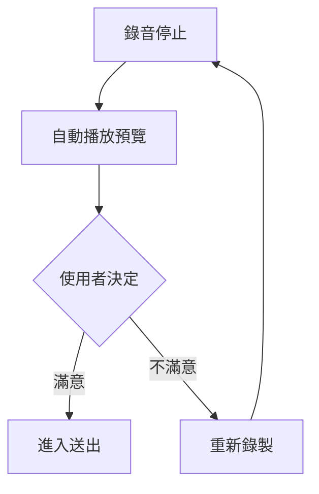

## 6. 匿名送出 — ✅ 已實作（Phase 3A，2026-08-04，Real API tested，見 [[15-Acceptance-Criteria]]）
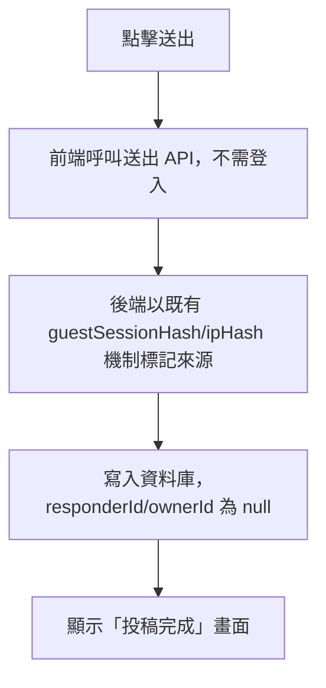
送出後建立的是 `PrayerResponse`（回應目前顯示的既有 Prayer），而非新建 `HomePrayerCard`，語意見 [[20-Anonymous-Submission-Design]]。

## 7. 上傳失敗與重試
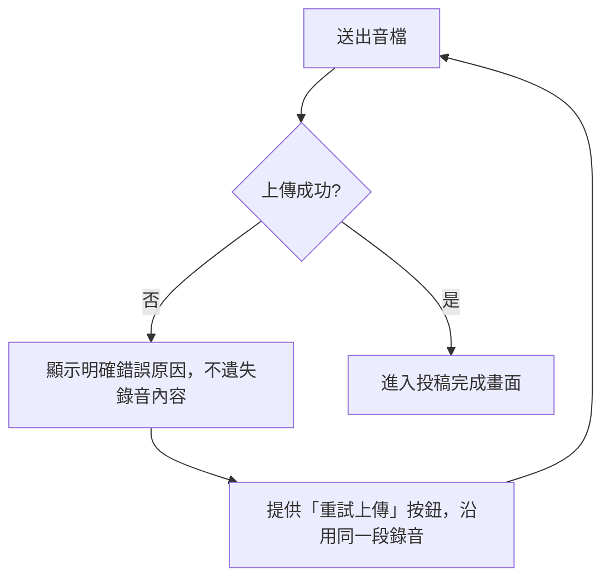

## 6b. 首頁左右瀏覽 Prayer — ✅ 已實作（Commit B，2026-08-04，Real Browser tested，見 [[15-Acceptance-Criteria]]）
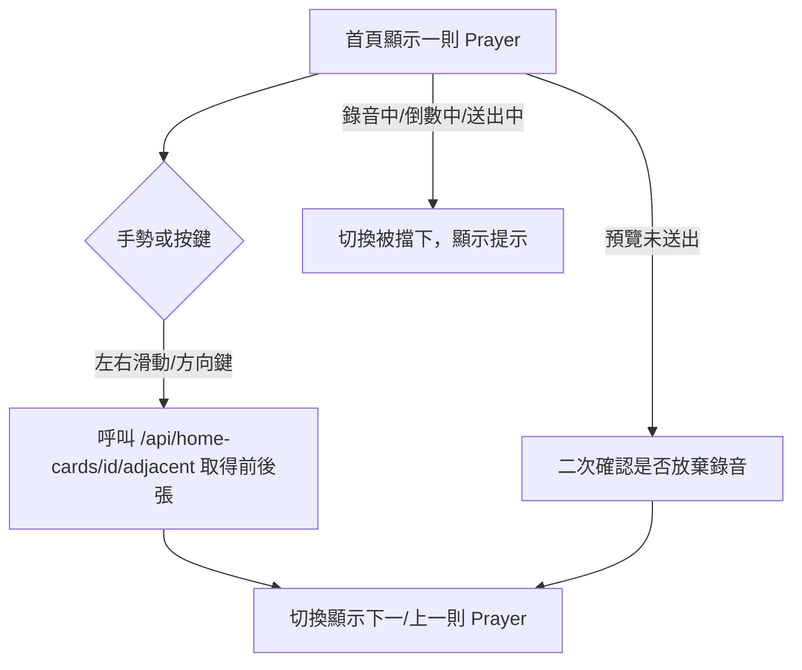
不允許在切換時建立新 Prayer，僅在既有清單中前後移動；輸入框聚焦或已進入陪伴模式時，鍵盤方向鍵不觸發切換。

## 8. 瀏覽並播放禱告 — ✅ 部分已實作（Commit B，首頁全螢幕陪伴模式；`/prayfor` 禱告牆列表播放維持既有實作，不在本次改動範圍）
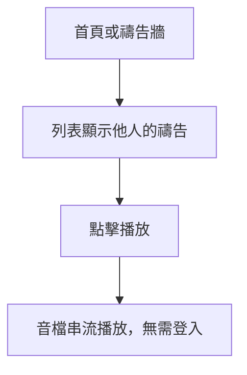
首頁陪伴模式的實作方式：點擊「聆聽其他人的禱告」進入全螢幕，重用既有 `AudioContext`/`GlobalPlayer` 播放引擎組裝清單、Loop、Stop、Exit、X（本地移除）；播放清單僅來自目前顯示中 Prayer 的可播放 `PrayerResponse`。詳見 [[25-Companion-Mode-Reuse-Audit]]「實際實作結果」。Real Audio Playback 本身因環境限制 Not Tested，見 [[24-Manual-QA]]。

## 8b. 匿名檢舉不當回應 — ✅ 已實作（Commit C1，2026-08-05，Real API/Browser tested，見 [[26-Anonymous-Reporting-Design]]）
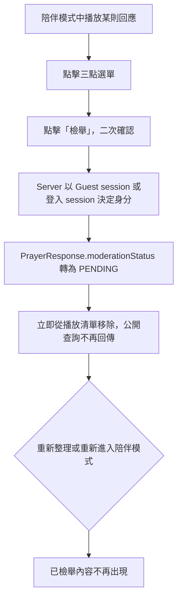
未登入與已登入訪客走同一支 `POST /api/prayer-response/report`；匿名檢舉不建立可逐筆稽核的 `PrayerResponseReport` 列（該表要求登入身分），改以 Response 自身狀態做冪等判斷 + `AdminLog` 粗粒度稽核 + DB-backed rate limit 防濫用，設計取捨詳見 [[26-Anonymous-Reporting-Design]]。此流程與「8. 瀏覽並播放禱告」共用同一個 `CompanionOverlay.js`，首頁與 `/prayfor/[id]` 皆適用（見 [[27-Shared-Prayer-Interaction-Audit]]）。

## 8c. `/prayfor/[id]` 匿名錄音 — ✅ 已實作（Commit C1，2026-08-05，Real Browser tested：permission-denied 真實路徑，Real microphone Not Tested）
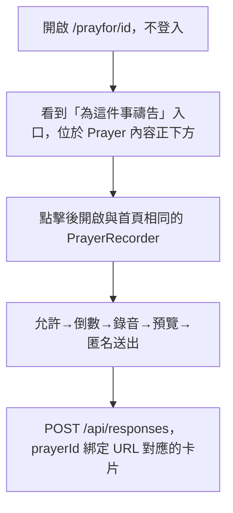
與首頁共用同一個 `PrayerRecorder` 元件與 Submit API，透過新抽出的 `usePrayerInteraction` Hook 共用狀態；頁面既有的 `Comments.js`（服務登入會員的文字/語音回應與檢舉）維持不動，兩條路徑並存但受眾不同，決策見 [[27-Shared-Prayer-Interaction-Audit]]。

## 9. 點擊「我為你禱告」 — ✅ 已實作（Commit 1，2026-08-05，Real API/Browser tested，見 [[28-Prayed-Reaction-Design]]）
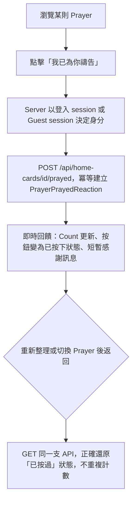
是一個獨立於 `PrayerResponse` 的輕量反應（不建立留言、不上傳音訊），與規劃時的假設完全一致：「不必然要求送出完整回應」。防止重複點擊灌水的機制是 `PrayerPrayedReaction` 的 `@@unique([prayerId, actorType, actorKeyHash])` 資料庫層級唯一約束，而非僅靠前端 `disabled` 屬性（前端 disabled 只是輔助，真正的防線在後端）。首頁與 `/prayfor/[id]` 共用同一個 `PrayedReactionButton`/`usePrayedReaction`，Prayer 左右切換時會正確讀取新 Prayer 自己的狀態，不會把上一則的「已按過」誤帶到下一則（Real Browser tested：swipe 到下一則變回未按過、swipe 回原本那則正確還原為已按過）。

## 10. 不登入情況下的內容管理方案
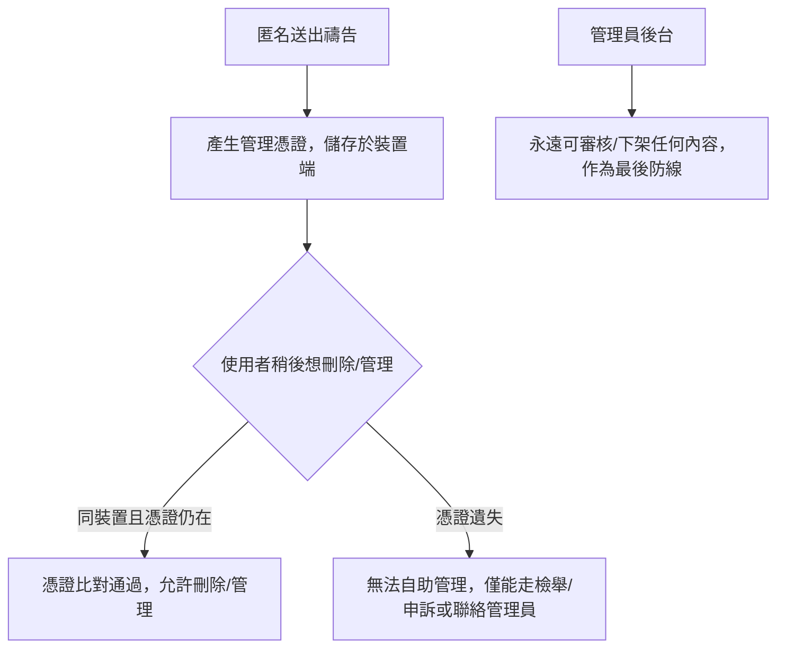

方案細節與比較見 [[09-Change-Impact-Analysis]] 及下方匿名架構章節（[[11-Decision-Log]] DEC-007）。
