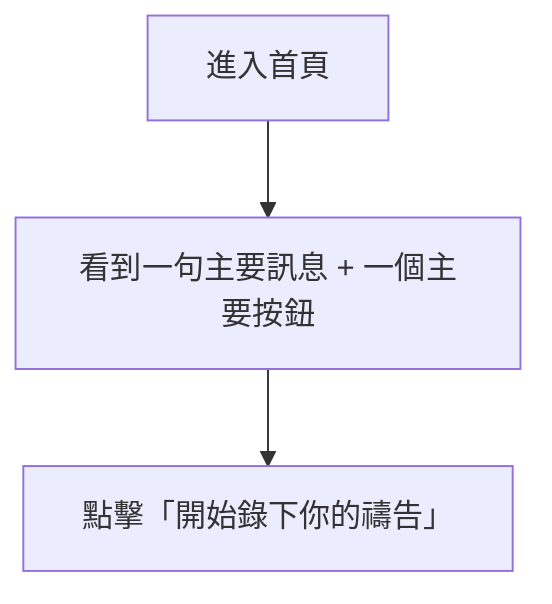
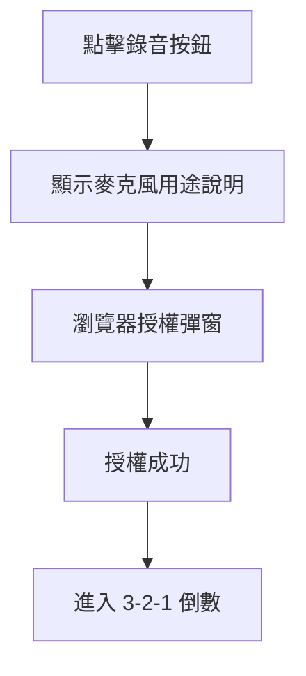
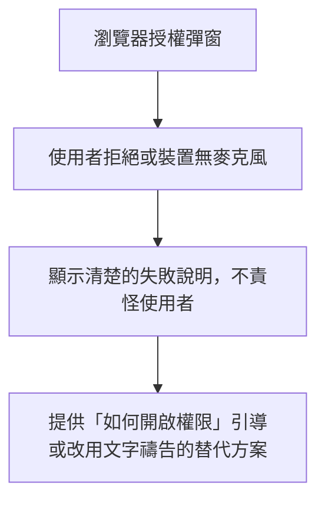
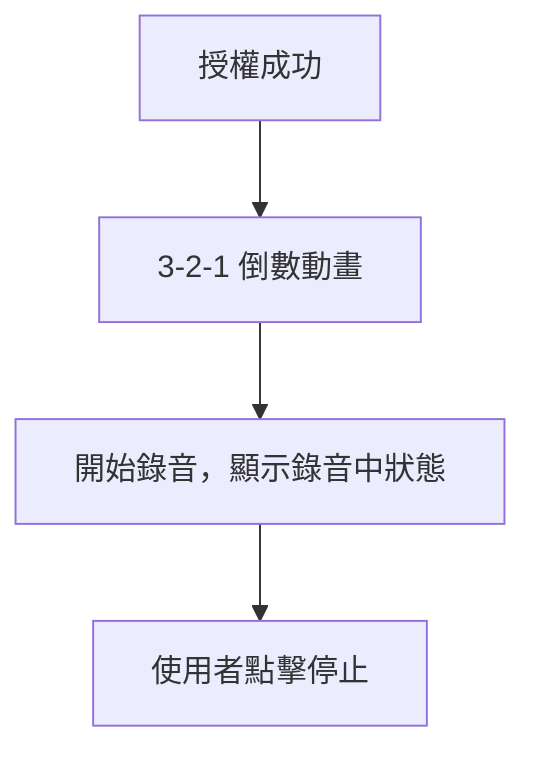
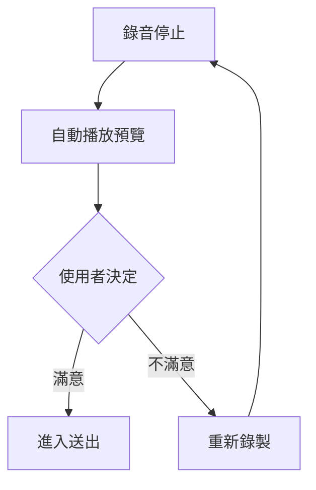
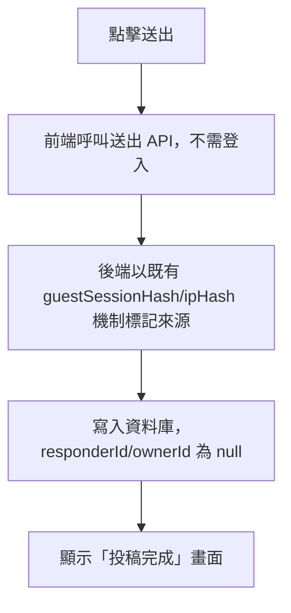
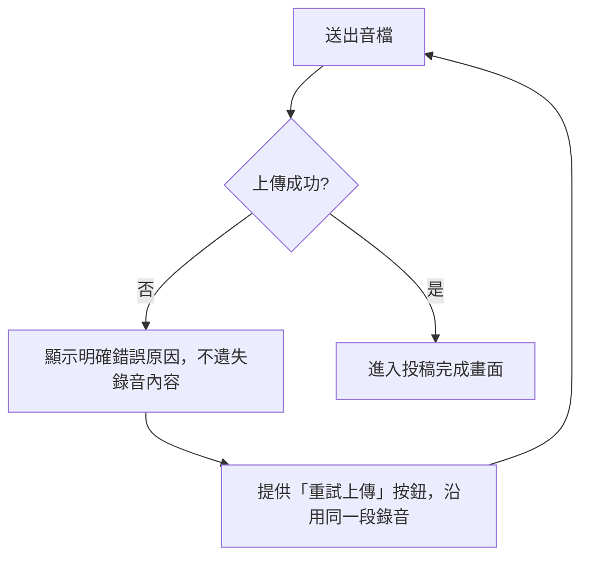
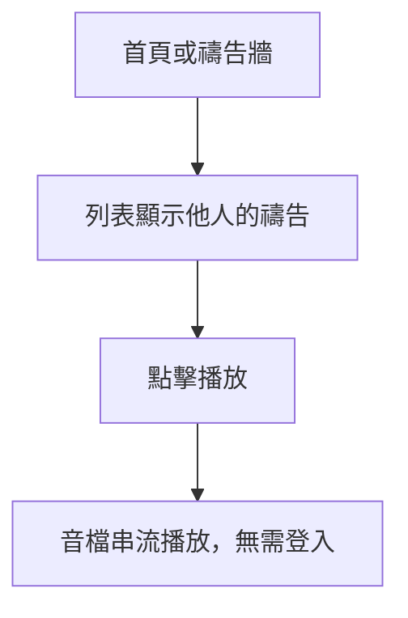
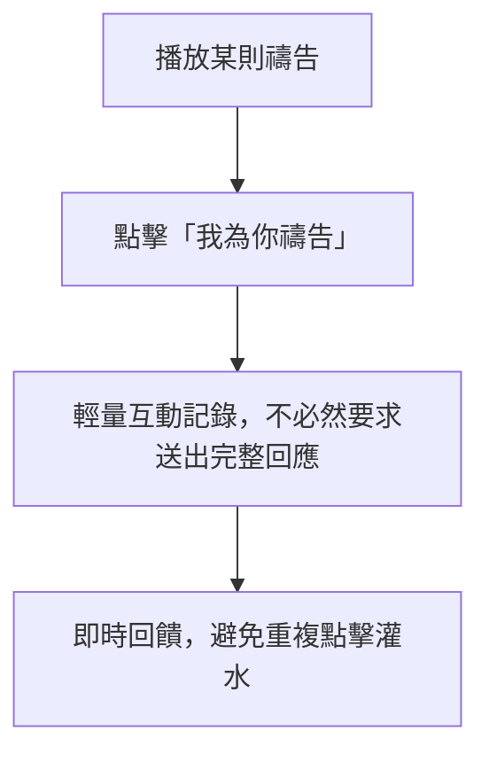
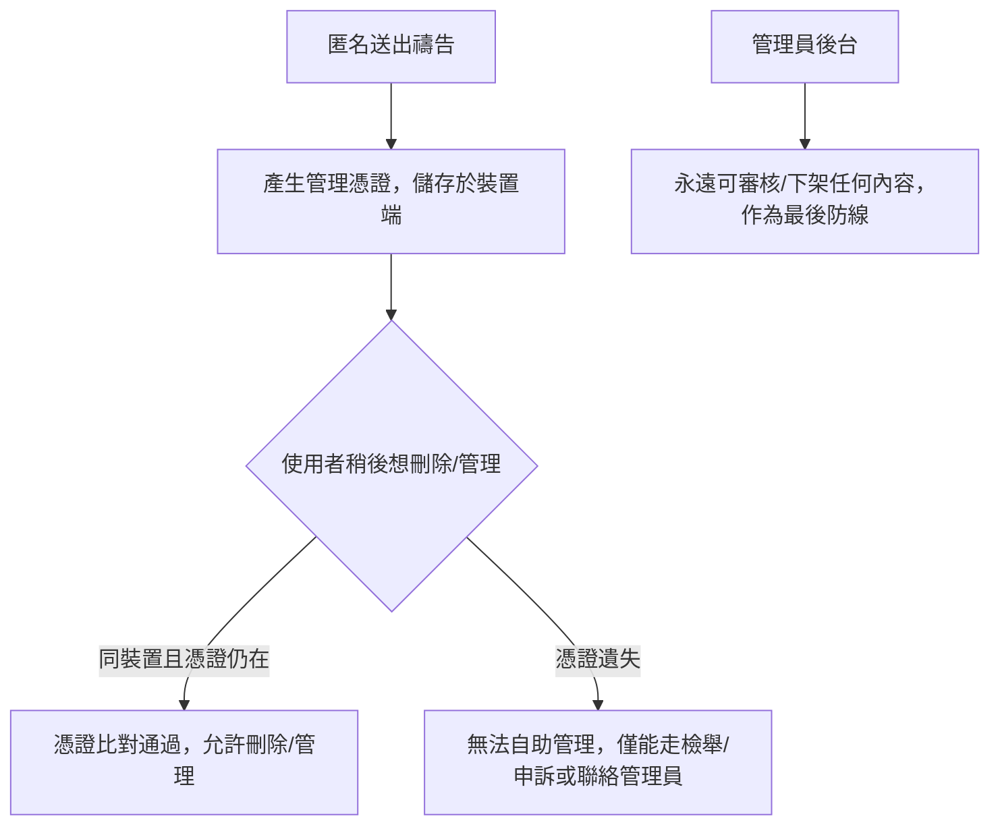

# 目標使用者流程（提案，部分已實作）

參見 [[07-Target-MVP]]、[[09-Change-Impact-Analysis]]、[[21-Recorder-State-Machine]]。以下原為**設計提案**；流程 1-5 已於 Commit 2、3（2026-08-04）在首頁實作為前端狀態機（`src/components/prayer-recorder/`），**尚未接上匿名投稿 API**，流程 6 起仍是提案，未實作。

## 1. 陌生人第一次進站 — ✅ 已實作（Commit 2）

## 2. 麥克風授權成功 — ✅ 已實作（Commit 3，Real microphone Not Tested，見 [[21-Recorder-State-Machine]]）

## 3. 麥克風授權失敗 — ✅ 已實作並經真實瀏覽器驗證（非 Mock，Browser 環境本身封鎖麥克風存取觸發了真實拒絕路徑）

## 4. 錄音與倒數 — ✅ 已實作（Real microphone Not Tested）

## 5. 播放確認與重錄 — ✅ 已實作，含重錄確認對話框（Real microphone Not Tested）

## 6. 匿名送出 — ❌ 尚未實作（本次「下一步：匿名送出」按鈕僅顯示 Prototype 提示文字，見 [[21-Recorder-State-Machine]]）

## 7. 上傳失敗與重試

## 8. 瀏覽並播放禱告

## 9. 點擊「我為你禱告」

## 10. 不登入情況下的內容管理方案

方案細節與比較見 [[09-Change-Impact-Analysis]] 及下方匿名架構章節（[[11-Decision-Log]] DEC-007）。
