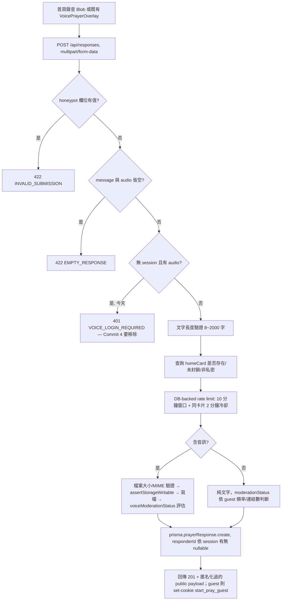

# 匿名投稿架構設計（Commit 4 前置分析）

參見 [[05-Data-Model]]、[[06-Authentication-Dependencies]]、[[22-API-Changes]]、[[23-Database-Migration]]。**本文件為純讀碼分析與設計提案，撰寫時未修改任何 Schema/API/Storage/Rate limit 程式碼。**

## 重大發現：匿名投稿地基已存在且已在運作

在深入讀碼 `src/app/api/responses/route.js`、`src/app/api/home-cards/route.js`、`src/lib/guest-response.js`、`src/lib/rateLimit.js` 後，發現先前文件（[[09-Change-Impact-Analysis]]、[[11-Decision-Log]] DEC-004/007）低估了現有系統的完成度。**匿名文字投稿與匿名建立禱告卡片，今天就已經在正式運作，不是提案。**

### 已存在且已運作的匿名機制
| 能力 | 位置 | 說明 |
|---|---|---|
| 匿名 Session 識別 | `src/lib/guest-response.js` | `createGuestId()` 用 `crypto.randomBytes(24)`（192-bit 熵，遠超 128-bit 需求）產生原始 ID；`hashGuestId()` 用 HMAC-SHA256（secret 來自 `GUEST_FINGERPRINT_SECRET`）雜湊後才存入 DB 的 `guestSessionHash` 欄位；原始 ID 只存在 httpOnly、`sameSite=lax`、正式環境 `secure` 的 cookie（`start_pray_guest`）中，**從未寫入 DB 明文** |
| 匿名建立禱告卡片 | `src/app/api/home-cards/route.js` POST | `ownerId: user?.id ?? null`；有 `assertGuestCanCreate()`：honeypot 欄位、必須勾選 `acceptedGuestTerms`、禁止語音連結/自訂圖片/多圖（強制預設縮圖）、IP-based rate limit（`GUEST_CREATE_LIMIT=3`/小時，**目前是 in-memory Map，非 DB-backed**） |
| 匿名文字回應 | `src/app/api/responses/route.js` POST | 免登入即可送出文字（`message`），`guestSessionHash`/`ipHash` 記錄來源，rate limit 為 **DB-backed**（`prisma.prayerResponse.count`，10 分鐘窗口內最多 5 則、同卡片 2 分鐘冷卻），guest 送出超過 3 則或含 2 個以上連結會自動進 `PENDING` 待審 |
| 每日 IP 雜湊 | `hashDailyIp()` | 以「日期+IP」組合做 HMAC，同一 IP 不同天會產生不同 hash，天然限制單日識別範圍而非永久追蹤 |

### 唯一的硬性 Auth 卡點
`src/app/api/responses/route.js:94-103`：
```js
if (!session && hasAudio) {
  return NextResponse.json({ code: "VOICE_LOGIN_REQUIRED", ... }, { status: 401 });
}
```
這是**整個系統中唯一**阻止匿名語音投稿的地方。拿掉這個檢查之後，音訊的驗證邏輯（檔案大小 ≤12MB、MIME 白名單、Storage 寫入、審核狀態評估）**全部已經寫好且不分登入與否都會執行**（見 `route.js:205-260`）。

### 發現的一個潛在 Bug（Commit 4 必須一併修正，否則匿名語音會直接 500）
`route.js:246-252`：
```js
const recentVoiceCount = await prisma.prayerResponse.count({
  where: {
    responderId: session.userId,   // ← session 為 null 時會 TypeError
    voiceUrl: { not: null },
    createdAt: { gte: recentVoiceWindowStart },
  },
});
```
若移除 94-103 的登入檢查但不修正這裡，匿名語音送出會在讀取 `session.userId`（`session` 為 `null`）時拋出例外。修正方式：比照上方文字回應已經在用的 `identityWhere` 模式（`session ? {responderId: session.userId} : {OR: [{guestSessionHash}, {ipHash}]}`），將這段查詢改成使用相同的識別條件。

## 現有投稿流程（實際讀碼結果）



每一步的檔案/風險對照：
| 步驟 | 檔案 | Function | Auth 依賴 | User ID 依賴 | Storage 依賴 | 風險 |
|---|---|---|---|---|---|---|
| 接收請求 | `src/app/api/responses/route.js` | `POST` | `readSessionUser()`（optional） | 否 | 否 | 低 |
| 語音登入卡點 | 同上 94-103 | — | **是（僅此處）** | 否 | 否 | 這是 Commit 4 要移除的唯一硬 gate |
| Session 存在時二次驗證 | `src/lib/customer-access.js` | `ensureActiveCustomer` | 是（僅會員路徑） | 是 | 否 | 低，不影響匿名路徑 |
| 頻率限制（文字） | 同 route.js 147-203 | inline | 否，用 guestSessionHash/ipHash | 否 | 否 | 低，已是 DB-backed |
| 頻率限制（語音，**待修正**） | 同 route.js 242-252 | inline | 否，但**現有程式碼會在 session 為 null 時崩潰** | **是（bug）** | 否 | **高——Commit 4 必修** |
| 檔案驗證 | 同 route.js 214-227 | inline | 否 | 否 | 否 | 低，已完整 |
| Storage 寫入 | `src/lib/server-media-storage.js`、`src/lib/storage/index.js` | `ensureMediaWriteDirectory`/`writeFile` | 否 | 否 | 是（本地檔案系統） | 中，見 [[23-Database-Migration]]/Storage 段落 |
| 審核評估 | `src/lib/voiceModeration.js` | `evaluateVoiceUpload` | 否 | 否 | 否 | 低 |
| 建立回應 | `prisma.prayerResponse.create` | — | 否，`responderId` optional | 否，nullable | 否 | 低，schema 已支援 |
| 建立禱告卡片（另一條路徑） | `src/app/api/home-cards/route.js` | `POST` | 否，`assertGuestCanCreate` | 否，`ownerId` nullable | 否 | 低，已在運作 |
| 查詢 Prayer | `src/app/api/home-cards/route.js` GET、`/api/responses/[homeCardId]` | — | 否 | 否 | 否 | 低 |
| 播放音訊 | `/voices/[...path]`、`/uploads/[...path]` | — | 否（無驗證） | 否 | 是 | 中，見 [[13-Risk-Register]]（既有風險，非本次引入） |
| 刪除禱告卡片 | `src/app/api/customer/cards/[id]/route.js` DELETE | — | **是（必須登入+擁有者）** | 是 | 否 | 匿名使用者今天完全無法刪除自己的投稿——這是唯一**真正需要新設計**的部分 |
| 刪除回應 | 未找到 DELETE endpoint（`/api/customer/responses/[id]` 只有 `PATCH`） | — | — | — | — | **匿名回應目前連會員都無法刪除**，需一併確認是否要新增 |
| Admin 管理 | `/admin/prayerresponse`、`/admin/prayfor` 及對應 API | — | 是（admin） | 否 | 否 | 不受匿名化影響，管理員永遠可下架/封鎖 |
| 檢舉 | 三張 Report 表 API | — | **是（reporterId 必填）** | 是 | 否 | 匿名使用者今天無法檢舉，需替代方案（本次不實作，見 [[14-Open-Questions]]） |

## 依賴矩陣

| 能力 | 現有實作 | Auth 依賴 | User ID 依賴 | Storage 依賴 | 匿名化修改 |
|---|---|---|---|---|---|
| 上傳音訊（文字回應的音訊分支） | `POST /api/responses` | 僅語音有硬 gate | 否（nullable） | 是（本地檔案） | 移除 94-103 gate + 修正 246-252 bug |
| 建立 Prayer（HomePrayerCard） | `POST /api/home-cards` | 否 | 否（nullable） | 否 | 無需修改，已可匿名 |
| 建立字幕工作 | 不存在（無後端 STT） | — | — | — | 見 [[03-Current-Feature-Inventory]]，本次不建立真轉錄服務 |
| 查詢 Prayer | `GET /api/home-cards` | 否 | 否 | 否 | 無需修改 |
| 播放音訊 | `/voices/[...path]`、`/uploads/[...path]` | 否 | 否 | 是 | 無需修改（本來就無驗證） |
| 刪除 Prayer（HomePrayerCard） | `DELETE /api/customer/cards/[id]` | 是 | 是 | 否 | **需新增匿名等價端點** |
| 刪除 Response | 不存在 | — | — | — | **需新增（會員與匿名皆缺）** |
| Admin 管理 | `/api/admin/prayerresponse`、`/api/admin/prayfor` | 是（admin） | 否 | 否 | 無需修改 |
| 會員投稿 | 同上，session 路徑 | 是 | 是 | 是 | 無需修改，維持相容 |
| Prayer count（「我為你禱告」） | 不存在獨立機制，目前用「送出回應」代替 | — | — | — | Commit 7 範圍，本次不實作 |
| 檢舉 | 三張 Report 表 API | 是 | 是 | 否 | 本次不實作匿名檢舉替代方案 |

## 匿名管理方案比較（延續 [[11-Decision-Log]] DEC-007，具體化為技術方案）

| 方案 | 優點 | 缺點 | 建議 |
|---|---|---|---|
| A. 完全匿名無管理 | 實作成本最低；今天文字/建卡已是這個狀態 | 使用者無法自行刪除任何投稿，只能靠檢舉/聯絡管理員 | 作為 fallback，不足以單獨支撐「使用者可管理自己內容」的期待 |
| B. localStorage device ID（無 server 驗證） | 前端實作簡單 | Client 可偽造，任何人都能刪除任何 Prayer——不安全，**不建議單獨使用** | 不建議 |
| C. Management Token（Server 產生、hash 儲存） | 安全性高，token 遺失前可放心刪除自己的內容；不需要新增使用者帳號 | 需要新增一個 nullable 欄位存 hash；token 遺失即永久失去管理權，需要清楚的 UX 說明 | **建議採用** |
| D. Anonymous Session（現有 `start_pray_guest` cookie） | 已存在、已在運作、零額外開發成本 | 依賴 cookie 存續（清除瀏覽器資料、換裝置、無痕模式皆會失效）；目前只用於 rate limit 識別，未用於「管理自己的投稿」 | **建議作為輔助識別**，但不足以單獨做為刪除授權依據（cookie 可能被同裝置其他人存取） |

**最終建議**：採方案 C（Management Token）作為刪除授權的唯一憑證，方案 D（既有 guest cookie）繼續沿用作為 rate limit 與濫用防護的識別依據——兩者職責不同，不衝突，可以並存。這與 DEC-007 先前的方向一致，本文件把它具體化為可執行的技術規格（見下方 Token 設計）。

## Token 設計
| 項目 | 規格 |
|---|---|
| 產生方式 | `crypto.randomBytes(32)`（256-bit，遠超 128-bit 需求） |
| 編碼 | `base64url`（沿用 `createGuestId()` 已使用的編碼方式，保持風格一致） |
| 儲存 | Server 僅存 `sha256(token)` 的 hex 摘要於新欄位（見 [[23-Database-Migration]]），原始 token **只在建立當下的 API 回應中出現一次** |
| Client 儲存位置 | `localStorage`，key 使用明確 namespace（例如 `startpray.manageToken.<prayerResponseId>`），不使用 cookie（管理 token 與 guest session cookie 是兩個獨立機制，不應混用同一個傳輸管道） |
| 比對方式 | 比較兩個 hash（`sha256(clientToken) === storedHash`）；Node `crypto.timingSafeEqual` 可用於等長 Buffer 比對，避免明顯的 timing side-channel |
| 記錄限制 | 原始 token 不得出現在 log、URL query string、資料庫欄位（只存 hash） |
| 遺失後果 | 無法恢復；UI 需明確告知「清除瀏覽器資料或更換裝置後，將無法再刪除這則投稿，但仍可透過檢舉或聯絡管理員處理」 |
| Token rotation | 本次不需要——每次投稿產生一次性 token，用途單一（刪除該筆投稿），無需輪替機制 |

## 尚未決定 / 待你裁示
1. Management Token 要同時套用在 `HomePrayerCard`（禱告卡片本身）還是只套用在語音 `PrayerResponse`？目前 `HomePrayerCard` 的匿名建立已存在，但「首頁極簡錄音」的產品定位（見 [[07-Target-MVP]]）核心其實是「錄一段話讓別人聽並代禱」，這在資料模型上比較接近 `PrayerResponse`（附掛在某個 `HomePrayerCard` 下）而非獨立建立新卡片——**需要你確認：首頁錄音送出後，究竟是要建立一張新的 `HomePrayerCard`（無主題/分類的訪客卡片），還是附掛到系統既有/自動指定的某張卡片作為 `PrayerResponse`？這個決定會直接影響 Schema 設計方向**，建議在動 Schema 前先確認。
2. 是否需要新增 `PrayerResponse` 的刪除 API（目前完全不存在，連會員都不能刪除自己的語音回應）？

以上兩點在 [[23-Database-Migration]] 中會分別列出方案，但**不會自行擇一套用**，需要你確認方向。
